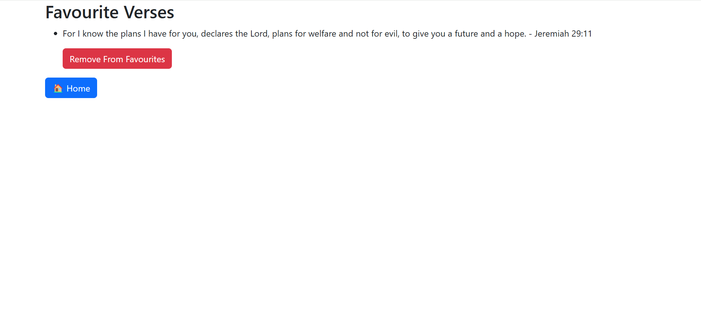

# Emotion Bible App

The Emotion Bible App is a Spring Boot application that provides Bible verses based on different 
emotions. Users can search for verses by emotion, get random verses, and manage their favorite verses.

## Features

- Search for Bible verses by emotion
- Get a random Bible verse based on an emotion
- Add and remove Bible verses from favorites
- View favorite Bible verses

## Technologies Used

- Java
- Spring Boot
- Spring Data JPA
- SQLite
- Maven

## Getting Started

### Prerequisites

- Java 11 or higher
- Maven
- SQLite

### Installation

1. Clone the repository:
   ```sh
   git clone https://github.com/oremowaiye/EmotionBible.git
   cd emotion-bible-app
2. Build the project using Maven:  
   mvn clean install
3.  Run the application:  
   mvn spring-boot:run


## Configuration

The application uses an SQLite database 
to store Bible verses. The database file is located in the `src/main/resources` directory and is named `emotionbible.db`. The database schema is created automatically when the application is started.

### application.properties

```ini
spring.datasource.url=jdbc:sqlite:src/main/resources/emotionbible.db
spring.datasource.driver-class-name=org.sqlite.JDBC
spring.jpa.database-platform=org.hibernate.community.dialect.SQLiteDialect
spring.jpa.hibernate.ddl-auto=update
spring.jpa.properties.hibernate.dialect=com.example.emotions.config.CustomSQLiteDialect

```
## Usage

Endpoints:

- Home  Page: http://localhost:8080/
- Get Verse by Emotion: /getVerse?emotion={emotion}
- Search by Emotion: /searchByEmotion?emotion={emotion}
- Add to Favorites: /favourites/add?verseId={verseId}
- View Favorites: /favourites
- Remove from Favorites: /favourites/remove?verseId={verseId}

Example
To get a random Bible verse for the emotion "joy", navigate to:

(http://localhost:8080/getVerse?emotion=JOY)


## Images




